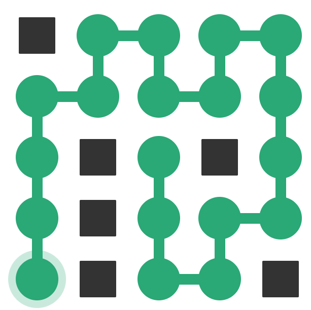
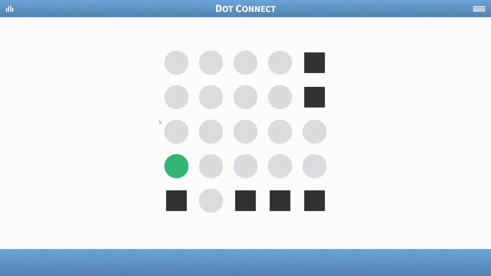
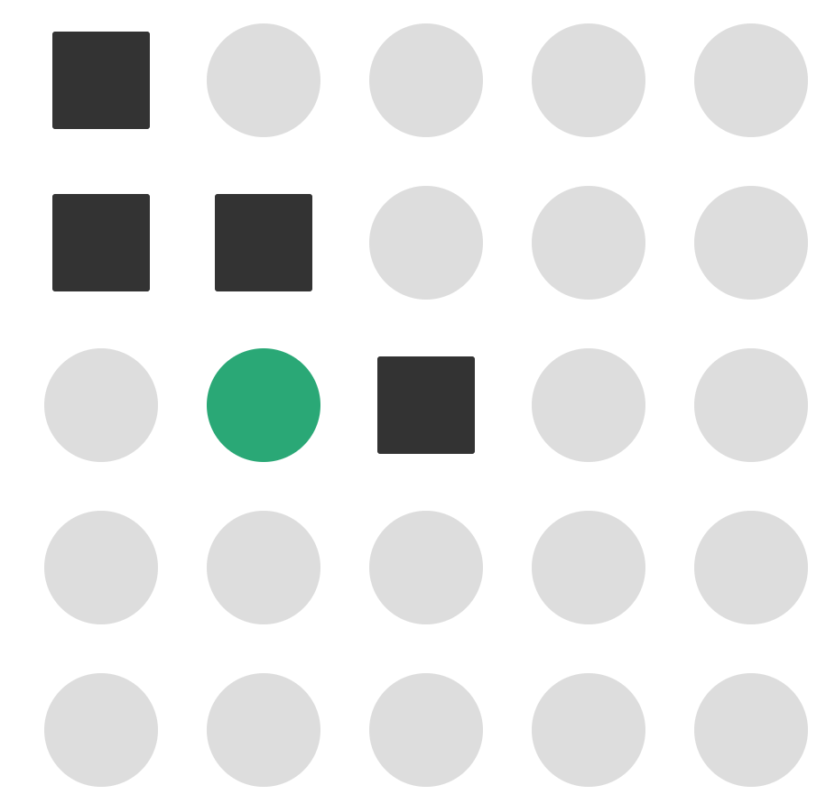
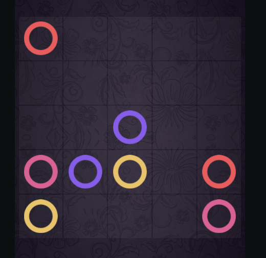

# Dot-Connect-Game
> Task Seleksi Lab IRK created by Nigel Sahl

versi **13/07/2024**

<!-- daftar isi -->
## Daftar Isi
- [Daftar Isi](#daftar-isi)
- [Latar Belakang](#💡-latar-belakang)
- [Spesifikasi Tugas](#📝-spesifikasi-tugas)
    - [Spesifikasi Wajib (XXX Poin)](#spesifikasi-wajib-xxx-poin)
    - [Spesifikasi Bonus (XXX Poin)](#spesifikasi-bonus-xxx-poin)
- [Batasan](#batasan)
- [Pengerjaan dan Pengumpulan](#📂-pengerjaan-dan-pengumpulan)
- [Penilaian](#📌-penilaian)
- [Referensi](#📚-referensi)

## 💡 Latar Belakang

Dot Connect adalah permainan yang mengasah kemampuan logika dan ketelitian. Permainan ini adalah sebuah permainan dimana pemain harus menghubungkan titik-titik yang ada di dalam papan permainan. Pemain harus menghubungkan titik-titik tersebut dimulai dari titik awal, lalu menghubungkan semua titik terbuka di papan. Sambungan dibuat secara vertikal atau horizontal, dan tanpa tumpang tindih. Tidak diperlukan urutan khusus atau jalur yang benar untuk memecahkan teka-teki tersebut, hanya saja semua titik harus terhubung. Referensi permainan ini adalah [Dot Connect Game](https://api.razzlepuzzles.com/dot_connect).

<div align=center>

<br>
  <b>Fig 1.</b> Ilustrasi permainan Dot Connect
<br>
</div>
<br>

<div align=center>

<br>
  <b>Fig 2.</b> Contoh animasi permainan Dot Connect
<br>
</div>
<br>

## 📝 Spesifikasi Tugas

Buatlah sebuah aplikasi web yang dapat memainkan permainan Dot Connect. Terdapat beberapa terminologi yang harus dipahami dalam permainan ini:

<div align=center>

<br>
  <b>Fig 3.</b> Tampilan awal permainan
<br>
</div>

- **Free dot**: Titik yang dapat dihubungkan dengan titik lainnya.
- **Blocked dot**: Titik yang tidak dapat dihubungkan dengan titik lainnya.
- **Start dot**: Titik awal permain

Tujuan dari permainan ini adalah menghubungkan semua titik yang terbuka (free dot), dimulai dari titik awal (start dot) sampai semua titik free dot terhubung tanpa melalui titik yang tidak bisa dilalui (blocked dot).

Aplikasi ini harus memenuhi minimal spesifikasi wajib berikut:

### Spesifikasi Wajib (XXX Poin)

0. **Skema Permainan:**
    - Terdapat dua option utama di awal permainan, yaitu "New Game" dan "Load Game".

    - "New Game" akan memulai permainan baru dengan membuat sebuah user baru. Terdapat dua input field yaitu username dan password serta sebuah button untuk create new user.
    Frontend (FE) akan mengirimkan request ke BE untuk membuat user baru. Backend (BE) akan mengecek apakah username sudah ada di database atau belum. Jika belum, maka BE akan membuat user baru dan mengirimkan response ke FE. Jika sudah ada, maka BE akan mengirimkan response ke FE bahwa username sudah ada dan FE akan meminta user untuk menginput username yang lain.

    - "Load Game" akan memulai permainan dengan memasukkan username dan password yang sudah ada. Terdapat dua input field yaitu username dan password serta sebuah button untuk load game. Jika username dan password yang dimasukkan benar, maka permainan akan dimulai. Jika salah, maka FE akan menampilkan pesan error dan meminta user untuk menginput username dan password yang benar.

    - Terdapat leaderboard yang menampilkan 5 user dengan skor tertinggi. Skor dihitung berdasarkan waktu yang dibutuhkan untuk menyelesaikan permainan. Terdapat filter berdasarkan level permainan dan mode permainan yaitu bot atau manual.

    - Setelah user berhasil masuk ke dalam permainan dengan `new game` atau `load game`, user akan diarahkan ke halaman setting permainan. Setting permainan terdiri dari:
        - Mode permainan
            - Manual mode:
                - User dapat memainkan permainan tersebut dengan mode random board atau custom board. 
                
                - Jika user memilih random board, maka board akan di-generate secara acak. Mekanisme penempatan dan jumlah blocked dot dan free dot **tidak harus** memenuhi syarat agar permainan dapat diselesaikan. Sehingga bisa saja terdapat board yang tidak dapat diselesaikan dan pemain dapat mereset permainan tersebut.

                - Jika user memilih custom board, maka user dapat memasukkan board yang sudah ada di dalam file JSON

            - Bot mode:
            Bot akan memainkan permainan tersebut secara otomatis. Board untuk mode ini hanya custom board dengan input file JSON.

        - Level permainan
            - beginner
            - easy
            - medium
            - hard

        - Button untuk memulai permainan

    - Catatan:
    Mahasiswa dibebaskan untuk menentukan tampilan FE selama memenuhi spesifikasi di atas. Seperti tata letak, warna, dan lain-lain.


1. **Implementasi Algoritma Penyelesaian Bot Mode:**
    - Algoritma yang diimplementasikan dapat berupa brute force, greedy, path finding,
    atau algorima lain yang diajarkan dalam mata kuliah Strategi Algoritma. Algoritma dapat beruba kombinasi dari beberapa algoritma seperti path finding dan greedy.
    - Algoritma harus bisa menyelesaikan permainan dalam waktu eksekusi di bawah 20 detik.

2. **Implementasi dalam Website:**
    - Menggunakan framework React untuk frontend.
    - Backend untuk database user dan leaderboard dibebaskan secara bahasa pemoograman dan framework.
    - Implementasi algoritma bisa dilakukan di frontend atau backend.
    - Menampilkan waktu secara real-time dari awal permainan sampai solusi ditemukan baik bot mode atau manual mode.

3. **Format Konfigurasi Board:**
    - Board berbentuk matriks dalam file JSON dengan ukuran sesuai board-nya.
    - Elemen matriks:
        - `0`: Titik kosong
        - `1`: Titik yang tidak bisa dilalui oleh garis
        - `2`: Titik mulai
    - contoh untuk gambar di Fig 3 untuk level beginner:
    <br>
    <div align=center>
    
    </div>
    <br>

    ```bash
    {
        "board": [
            [1, 0, 0, 0, 0],
            [1, 1, 0, 0, 0],
            [0, 2, 1, 0, 0],
            [0, 0, 0, 0, 0],
            [0, 0, 0, 0, 0]
        ]
    }
    ```
    - contoh lain gambar board dapat dilihat di folder [img](./img) di repository ini.

4. **Ukuran Board:**
    - Ukuran board mengikuti referensi game yaitu Beginner, Easy, Medium, Hard (5x5, 6x8, 6x10, 8x12).

5. **Repository:**
    - Backend dan frontend diletakkan dalam repository yang sama.
    - Terdapat README.md yang berisi        
        - identitas pembuat 
        - Penjelasan singkat mengenai aplikasi 
        - Tech stack yang digunakan
        - Penjelasan algoritma yang digunakan
        - Cara menjalankan aplikasi
        - Bonus yang diimplementasikan

### Spesifikasi Bonus (XXX Poin)

1. **Game Tambahan - Color Dot Connect: (600 Poin)**
    Membuat game tambahan di mode game awal sebelum memulai permainan. Referensi game tambahan adalah [Color Dot Connect](https://www.cokogames.com/color-dot-connect/play/).
    - Membuat game tambahan yaitu Color Dot Connect serta membuat algoritma bot mode untuk game tambahan tersebut. Spesifikasi lain seperti mode dan skema mengikuti game spesifikasi wajib pada poin 0.
    - Level permainan **hanya beginner** yakni ukuran board hanya 5x5. Dengan jumlah warna yang berbeda maksimal dibebaskan dengan minimal 2 warna. 
    - Algoritma untuk game tambahan ini boleh berbeda dari algoritma Dot Connect.
    - Konfigurasi board untuk game tambahan:
        - Elemen matriks:
            - `0`: Sebagai titik kosong atau free dot
            - `1`: Sebagai titik mulai (start dot) atau titik akhir (end dot) untuk warna pertama
            - `2`: sama seperti `2` namun untuk warna kedua
            - dst
        - Tidak ada blocked dot pada game tambahan ini. Namun setiap warna harus terhubung dengan warna yang sama dan garis dari warna yang berbeda tidak boleh saling bersinggungan atau melewati titik warna yang berbeda. Mahasiswa bisa mencoba game referensi di [sini](https://www.cokogames.com/color-dot-connect/play/) untuk memahami rule permainan.
    - Contoh konfigurasi board untuk game tambahan:
        <br>
        <div align=center>
        
        <br>
        <b>Fig 4.</b> Tampilan awal permainan Color Dot Connect
        </div>
        <br>
    ```bash
        {
            "board": [
                [1, 0, 0, 0, 0],
                [1, 1, 0, 0, 0],
                [0, 2, 1, 0, 0],
                [0, 0, 0, 0, 0],
                [0, 0, 0, 0, 0]
            ]
        }
    ```

2. **Animasi Jalannya Algoritma: (150 Poin)**
    - Membuat animasi jalannya algoritma dari titik mulai sampai solusi ditemukan.

3. **Model Algoritma:** (**210 Poin**)
    - Membuat beberapa model algoritma dasar(minimal 3, misal greedy, brute force, dan UCS). Masing-masing algoritma 70 poin dengan batas maksimum poin adalah 210.
    - Algoritma dasar ini tidak harus menyelesaikan permainan dalam batasan waktu yang diberikan.
    - Sehingga total algoritma adalah 4 yaitu 3 model algoritma dasar dan 1 algoritma utama misal gabungan beberapa algoritma dasar atau algoritma dasar yang sudah dimodifikasi dengan heuristik atau pendeekatan lain.


## Batasan

- Waktu eksekusi harus di bawah 20 detik.

## 📂 Pengerjaan dan Pengumpulan

1. Buatlah repositori **private** pada github masing-masing dan invite `[your github account]` dalam repositori tersebut.
2. Berkas yang dikumpulkan berupa **link rilis tag ke repositori github** yang telah dibuat dengan ketentuan sebagai berikut.
    - Memberikan tag `vn` pada commit terakhir Anda setiap kali ingin melakukan submisi dengan `n` adalah jumlah submisi yang telah dilakukan. (contoh: `v1` untuk submisi pertama).
    - **Tidak menggunakan *url shortener*** (bit.ly, shortlink, atau yang lain) saat melakukan pengumpulan *task*.
    - Anda dapat melakukan rilis dengan panduan [berikut](https://docs.github.com/en/repositories/releasing-projects-on-github/managing-releases-in-a-repository).
3. **Lakukan submisi** pada website seleksi IRK dengan menggunakan akun std.stei.itb.ac.id, **lakukan konfirmasi** ke LINE `@nigelsahl27`, dan **jadwalkan demo** dengan cara yang sama. Lakukan hal yang sama jika membuat rilis yang baru.
4. Jika terdapat pertanyaan dapat menghubungi LINE `@nigelsahl27` (harap bersabar jika tidak segera dijawab, bisa chat lagi jika dalam waktu 1x12 jam tidak ada balasan karena nigel sedang melaksanakan kerja praktik).

## 📌 Penilaian
Penilaian akan berdasarkan implementasi spesifikasi wajib dan bonus yang telah dijelaskan sebelumnya.

- Ketepatan implementasi algoritma penyelesaian bot mode. (Kesesuaian antara nama algoritma yang digunakan dengan implementasi yang dibuat) misal algoritma greedy tapi implementasi tidak sesuai dengan algoritma greedy seperti path finding
- Kecepatan algoritma penyelesaian bot mode sesuai batasan waktu yang diberikan
- Kelengkapan fitur yang diimplementasikan
- Tampilan aplikasi web yang dibuat
- Kualitas kode yang dibuat
- Keberhasilan dalam memenuhi spesifikasi wajib dan bonus
- Ketepatan bonus yang diimplementasikan
- Kelengkapan readme yang dibuat

Berikut distribusi skor dengan rata-rata waktu eksekusi tercepat berdasarkan test case yang diberikan (**Hanya dilakukan untuk 10 mahasiswa yang melakukan submisi tercepat**)

| Posisi | Poin Bonus Tambahan |
| ----------- | ----------- |
| 1   | 200 |
| 2   | 150 |
| 3   | 100 |
| 4   | 50  |
| 5   | 25  |
| 6 dst | 0   |

## 📚 Referensi
- [Dot Connect Game](https://api.razzlepuzzles.com/dot_connect)
- [Color Dot Connect](https://www.cokogames.com/color-dot-connect/play/)


Semangat mengerjakan! 
**Good Luck!**